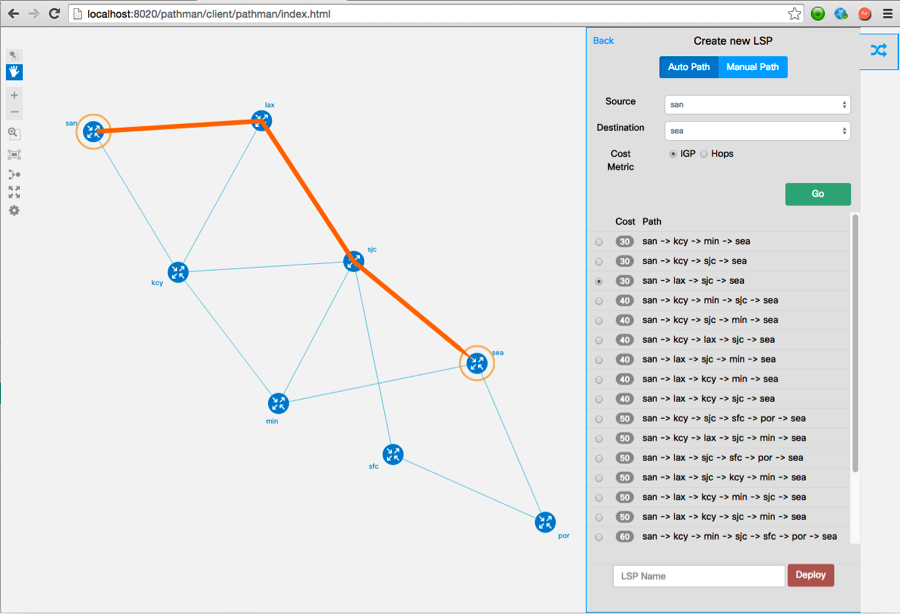

# Introduction

NeXt UI is a Javascript/CSS framework for frontend developers who need to embed topology interaction into their web applications. NeXt features MVVP, OOP and DOM manipulation.

To jump into learning you are required to know JavaScript (along with JSON) and HTML. Basic knowledge or understanding of CSS, SVG and Object Oriented Programming may be of use. 

We highly recommend using NeXt UI with [AngularJS](http://angularjs.org).

## Real use of NeXt
### Screenshots

*Figure 1. BIERMAN - main screen*

*Figure 2. PCE-OpenFlow - main screen*

*Figure 3. Pathman (v1) - main screen*

*Figure 4. AutoDev - main screen*

### References
Check out these and more apps running NeXt:

* [Cisco DevNet Labs](https://developer.cisco.com/site/devnetlabs/)
* [BIERMAN](https://github.com/zverevalexei/bierman-gui)
* [PCE-OpenFlow](https://github.com/CiscoDevNet/pceof-gui)
* [Pathman](https://github.com/CiscoDevNet/Opendaylight-BGP-Pathman-apps)
* [AutoDev](https://github.com/CiscoDevNet/iotvizconf)

## Good to start?
Now that you know what NeXt is created for, how about spin it up in your environment?

[Read NEXT](./tutorial-001.md)