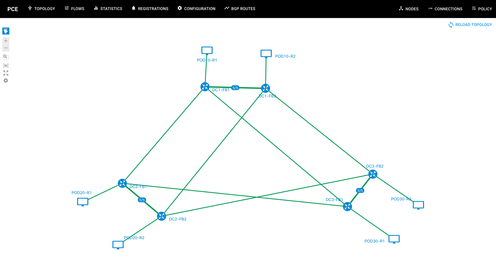
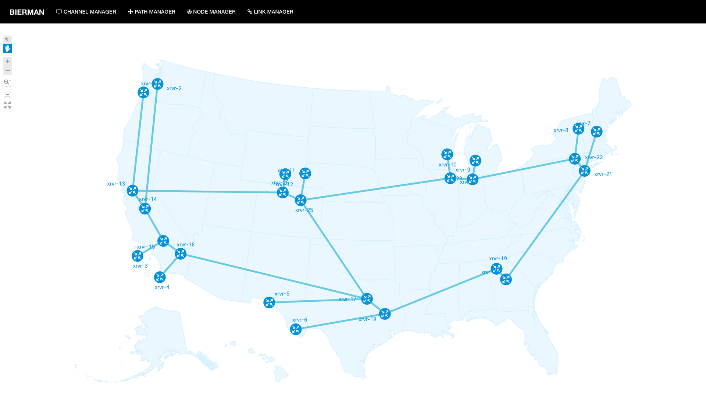

# Introduction

NeXt UI is a Javascript/CSS framework for frontend developers who are in need to embed topology interaction into their web applications. NeXt features MVVP, OOP and DOM manipulation. NeXt renders network topologies and enables user interaction with them through event listeners.

To jump into learning you are required to know JavaScript (along with JSON) and HTML. Basic knowledge or understanding of CSS, SVG and Object Oriented Programming may be of use. 

We highly recommend using NeXt UI with [AngularJS](http://angularjs.org): this fab duo has proven its efficiency in a number of apps. Check some of them out on [Cisco DevNet Creations](https://developer.cisco.com/site/devnetcreations/).

## Portfolio

NeXt has been a life vest for a bunch of open-source SDN efforts at [Cisco](https://cisco.com). Some of apps were built entirely in NeXt (by means of NeXt UI component), while the rest tend to employ AngularJS as a basement with NeXt's topology component. 

Check out a few awesome apps that we at Cisco have developed to boost SDN initiative.
 
### Featured apps

#### Path Computation Element - OpenFlow

Path Computation Element - OpenFlow (PCE-OF) is the app that enables SDN controller to compute paths by using so-called "policies" - sophisticated routing rules. [Learn more](https://github.com/CiscoDevNet/pceof-gui).

*Figure 1. PCE-OpenFlow - main screen*

#### BIERMAN

BIERMAN is the app to manage and monitor BIER-enabled networks (BIER is a Cisco's appoach for multicast). [Learn more](https://github.com/zverevalexei/bierman-gui).

*Figure 2. BIERMAN - main screen*

#### Pathman

Pathman was created to provide a way for path computation between routers that support BGP-LS and/or PCEP. Beside computation, deployment of paths is also available as well as big picture of the network. [Learn more](https://developer.cisco.com/site/devnetcreations/detail.gsp?submitId=171055).

*Figure 3. Pathman (2014) - main screen*

#### Pathman SR

Pathman Segment Routing (Pathman SR) is a successor of Pathman, made with purpose to compute and deploy paths in SR-enabled network. [Learn more](https://github.com/CiscoDevNet/pathman-sr).

*Figure 4. Pathman SR (2016) - main screen*

#### IoT VizConf - AutoDev

AutoDev is a solution for managing IoT sensors on mobile vehicles. IoT VizConf (shorthand for IoT Visualization and Configuration) is an AutoDev application running on top of OpenDaylight (ODL) supporting IoT device/sensor visualization and sensor programming. [Learn more](https://github.com/CiscoDevNet/iotvizconf). 

*Figure 5. AutoDev - main screen*

### References
Check out these and other awesome apps running NeXt:

* [BIERMAN](https://github.com/zverevalexei/bierman-gui)
* [PCE-OpenFlow](https://github.com/CiscoDevNet/pceof-gui)
* [Pathman](https://github.com/CiscoDevNet/Opendaylight-BGP-Pathman-apps)
* [AutoDev](https://github.com/CiscoDevNet/iotvizconf)
* [Cisco DevNet Creations](https://developer.cisco.com/site/devnetcreations/) (portal of open-source applications)

## Good to start?
Now that you know what NeXt is created for, how about spin it up in your environment?

[Read NEXT](./tutorial-001.md)