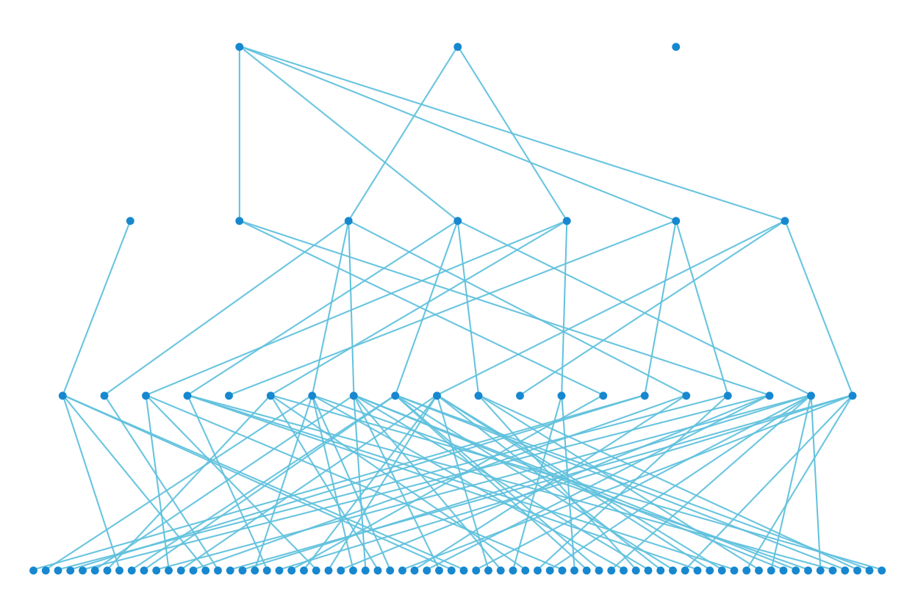
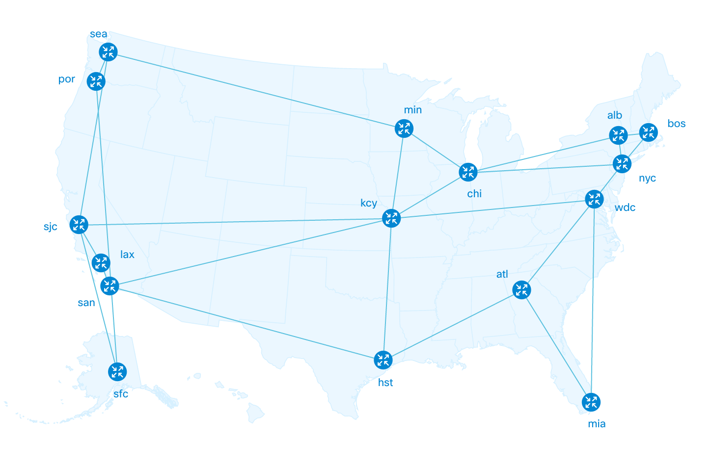

# Layouts
Layout define the way the topology looks like. It may come with a data processor, not necessarily.

Just like data processors, there are a number of built-in layouts that provide you the typical functionality and presentation.

## Built-in Layouts
These are layouts NeXt is served with. We do recommend you to familiarize youself with them, as you will no longer need to create 

### Hierarchical Layout
This layout creates a hierarchy of nodes level by level. What you need is to tell NeXt what layer is the first, the second etc...

#### Hierarchical Layout: Demo

See code snippet on [Codepen](http://codepen.io/NEXTSUPPORT/pen/PGZQdQ/)

### US Map
US Map layout depicts the USA outline and provides geographic coordinate system (*latitude* and *longitude*) instead of a normal Cartesian system (with *x-* and *y-* axes). That prevents a developer from translating the geographic coordinates into [x;y] location, which requires some effort. However, access to them remains.

#### US Map: demo
Here's how it might look like.

### World Map
The distributive version of NeXt does not contain the World Map layout anymore, because it slows down the application's performance.

## Create Your Layout
TBD

## What's next?
The following tutorial has a big practial application. It tells you about *scene*, which will give you access to many topology events.

[Read NEXT](./tutorial-003-07.mds)