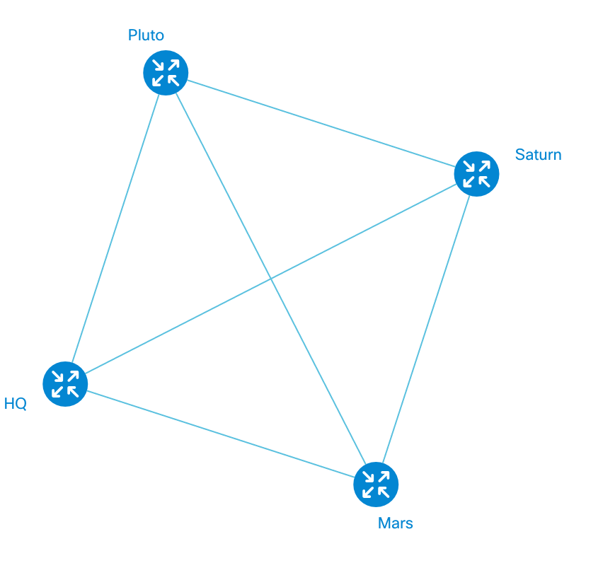

# Quick Start

## Installation
Create a separate empty folder for this app.

We described [installation process](/tutorials/tutorial-001.md) in a special article. We **highly recommend** you to install [bower](https://bower.io) and [NPM](http://npmjs.com), since it could make your life a little bit better.

## Initial Set-up
We assume you used *bower*; so you should only have *bower_components* directory in the project folder. Create a few folders and files to make the project structure look like this:

```
app/
	main.js
	topology.js
	topology_data.js
bower_components/
	next-bower/
index.html
style.css
```

*app* is a directory for the project JavaScript files (we'll see what they do later on). They are empty yet. *bower_components* is a standard directory created by *bower* package manager. *index.html* and *style.css* are the main page and an empty stylesheet file respectively.

Let's bootstrap the JavaScript and CSS files to the index page.

**index.html**

```HTML
<!DOCTYPE html>
<html>
<head>
	<title>Quick start with NeXt</title>
	<!-- NeXt library -->
	<link rel="stylesheet" href="bower_components/next-bower/css/next.min.css">
	<script type="text/javascript" src="bower_components/next-bower/js/next.min.js"></script>
</head>
<body>
	<div id="topology-container"></div>
	<!-- Application scripts -->
	<script type="text/javascript" src="app/topology_data.js"></script>
	<script type="text/javascript" src="app/topology.js"></script>
	<script type="text/javascript" src="app/main.js"></script>
</body>
</html>
```

Super! What have we got here? Inside ```<head>``` container you are including the library files (JS and CSS). The ```<div>``` in the ```<body>``` has an ID (```topology-container```) that will be used later to assign the topology with a DOM element. Underneath there are three JavaScript files included. Now they are empty, but we'll take care of that in a while.

Open the *index.html* in a browser, then you will see an empty page. Try to open a developer console and verify if any error messages pop up (they should not).

## It's Show Time!
Let's add some color to the page: we are going to add topology to the page.

### app/topology_data.js
Open ```app/topology_data.js``` and add the lines below. This is the topology structure that follows [Common Topology Model](/tutorials/tutorial-002.md). 

```JavaScript
var topologyData = {
	"nodes": [
		{
			"id": 0,
			"name": "HQ"
		},
		{
			"id": 1,
			"name": "Mars"
		},
		{
			"id": 2,
			"name": "Saturn"
		},
		{
			"id": 3,
			"name": "Saturn"
		}
	],
	"links": [
		{
			"id": 0,
			"source": 0,
			"destination": 1
		},
		{
			"id": 1,
			"source": 0,
			"destination": 2
		},
		{
			"id": 2,
			"source": 0,
			"destination": 3
		},
		{
			"id": 3,
			"source": 1,
			"destination": 2
		},
		{
			"id": 4,
			"source": 2,
			"destination": 3
		},
		{
			"id": 5,
			"source": 3,
			"destination": 1
		}
	]
};
```

### app/topology.js

```JavaScript
(function (nx) {
	nx.define('MyTopology', nx.graphic.Topology, {
		methods: {
			"init": function(){
				this.inherited({
					// width 100% if true
					'adaptive': false,
					// show icons' nodes, otherwise display dots
					'showIcon': true,
					// special configuration for nodes
					'nodeConfig': {
						'label': 'model.name',
						'iconType': 'router',
						'color': '#0how00'
					},
					// special configuration for links
					'linkConfig': {
						'linkType': 'curve'
					},
					// property name to identify unique nodes
					'identityKey': 'id', // helps to link source and target
					// canvas size
					'width': 1000,
					'height': 600,
					// "engine" that process topology prior to rendering
					'dataProcessor': 'force',
					// moves the labels in order to avoid overlay
					'enableSmartLabel': true,
					// smooth scaling. may slow down, if true
					'enableGradualScaling': true,
					// if true, two nodes can have more than one link
					'supportMultipleLink': true,
					// enable scaling
					"scalable": true
				});
			}
		}
	});
})(nx);
```
Remember [inheritance](/tutorials/tutorial-005-3)? This is what we are taking advantage of here. There's a built-in class ```nx.graphic.Topology``` that encapsulates everything we need to manipulate a topology. Then we are *inheriting* the class and in the constructor (```init```) we are overriding existing properties with ```this.inherited```.

Each property is commented, so you should not be having a problem with that.

### app/main.js
Finally, our most important final that puts everything together.

```JavaScript
(function(nx){

	// instantiate NeXt app
	var app = new nx.ui.Application();

	// instantiate Topology class
	var topology = new MyTopology();

	// load topology data from app/data.js
	topology.data(topologyData);

	// bind the topology object to the app
	topology.attach(app);

	// app must run inside a specific container. In our case this is the one with id="topology-container"
	app.container(document.getElementById("topology-container"));

})(nx);
```

Comments in the code describe it sufficiently.

## Demo
That's time to run the application. When you open the page, what you see should look like this:



We encourage you to play with properties in order to understand their nature. 

## What's Next?
You have just created a generic topology. What we need to do is to adapt it for a special use-case. Our next lesson will start the topic called *customization*.

[Read NEXT](/tutorials/tutorial-007-02.md)
